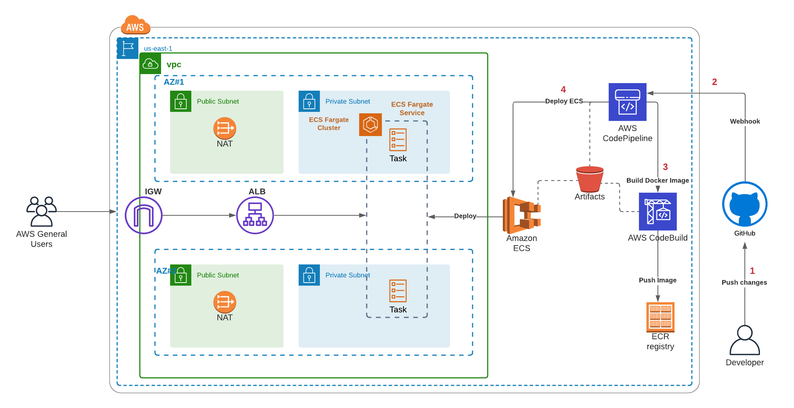
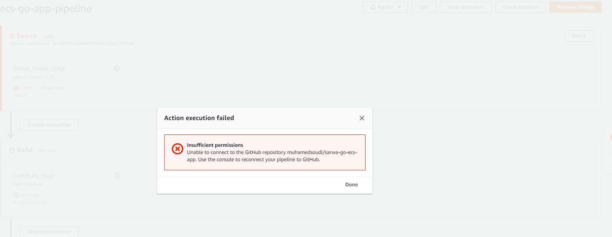
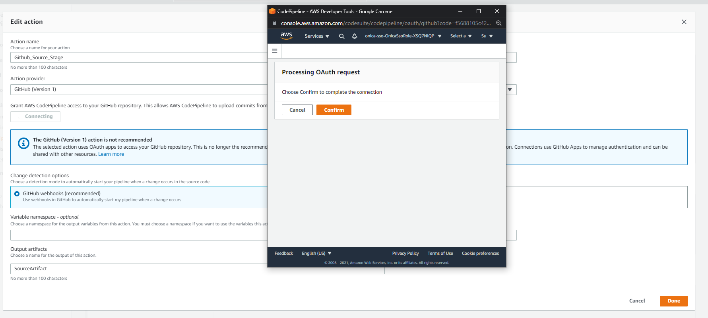

# Implementing CI/CD for Containerized Golang Application on AWS using ECS and CodePipeline.



## Overview

CI/CD (Continous Integration/Continous Deployment) plays an important role in application lifecycle management. CI/CD pipelines are repeatable, less prone to errors, and they are self-explanatory – can serve as documentation of the deployment process.
This repository contains a very simple CI/CD pipeline for Golang Rest API Application. We're using AWS CodePipeline as CI/CD orchestration tool if 
and our infrastructure deploys on Amazon AWS. 

This CI/CD pipelines consist of the following stages:
source  - GitHub     –    take latest changes from source control including Dockerfile
build   - CodeBuild  -    Build the Dockerfile and push it to amazon Container registry (ECR)
deploy  - Amazon ECS -    Deploy the latest Task Definition on the ECS Cluster

And because we are going to host our application into amazon container service (ECS), we have to deploy our infrastructure first to achieve our goal.
Under this repository, there is a terraform directory containing all the infrastructure needed such as Amazon VPC, Subnets, Internet Gateway, Nat Gateway, Security Groups, Application Load Balancer, Target Group, Amazon ECS Cluster, ECS Service, ECR and, task definition.


## Prerequisites

1. Tools
    * AWS Account
    * AWS CLI
    * Terraform
    * md5 or md5sums

2. AWS CLI Configuration
    * In order to interact with your AWS Account using AWS Command Line Interface (AWS CLI), You have to set your local terminal session with the AWS credentials. You can execute the following script to perform the configuration.
    ```bash
        export AWS_ACCESS_KEY_ID="<AWS_ACCESS_KEY>"
        export AWS_SECRET_ACCESS_KEY="<AWS_SECRET_KEY>"
    ```
    
3. Custom Terraform Variables
    * Under `terraform` directory, we have a file called `variables.tf` containing all the variables descriptions with default values. To have your custom values, you can either change them directly at the mentioned file or the recommended way to create a new file `e.g. terraform.tfvars` and set all the values you need in a Key/Value pair manner.

## Deployment

* To deploy this solution, clone the source code and from inside the cloned directory, execute the below script.
    ```bash
        cd terraform
        terraform init
        terraform plan  -- OPTIONAL: If you want to check the execution plan geerated by terraform before deploying it.
        terraform apply <-auto-approve>
    ```
* The deployment may take some time (depending on your internet speed) because an initial Docker image will be built and pushed to Amazon ECR using terraform provisioner.

## Demo

1. The first `.gif` below shows that the go rest API application can be accessible by hitting the application load balancer endpoint that is thrown at the output section after terraform completes the deployment.


2. The second `.gif` is about the CI/CD pipeline developed & deployed using some AWS services include AWS CodePipeline and AWS CodeBuild and this pipeline uses Github as source control. The pipeline can be kicked off by pushing changes to the main branch under this repository then it starts a new build using codebuild project to build & push a new docker image to amazon ECR and at the end, the pipeline will deploy these changes using amazon ECS to the configured ECS Cluster and service. It takes some time for the ALB target group to deregister the old versions of the ECS tasks.


## Troubleshooting

* Sometimes, AWS Codepipeline fails to pull source code from Github. It seems that this issue is a known one and AWS still doesn't have a resolution for it.



To resolve it, you have to reconnect again to the github repo and set the repository name to `sarwa-go-ecs-app` and branch to `main`.




## Future Iteration
 
* Enhance the pipeline by adding more stages such as the following:
    1. Testing stage to Test the code before deploying it.
    2. Notifications to send email/SMS/slack notifications upon success/failure. 
* Cache the Docker image layers to amazon s3 during building the image for better performance.
* Use GitHub Action V2 instead of V1 (CodeStar Connection) as recommended by AWS to get rid of the OAuth apps or personal access tokens needed to access your repository.
* Adjust the ECS Service configuration by enabling the Auto Scaling feature to adjust the service’s desired count (Scale In/Out).
* Switch to the Blue/Green deployment With CodeDeploy startegy instead of the current Rolling Update one for more control On How to replace application old version with the latest one. 
* Get rid of the NAT gateways by deploying the ECS services on the public subnets (based on application need) or using VPC PrivateLink Endpoints instead.

## References
* [Infrastructure as a code](https://en.wikipedia.org/wiki/Infrastructure_as_code)
* [Terraform](https://www.terraform.io/)
* [CI/CD Concepts](https://www.synopsys.com/glossary/what-is-cicd.html)
* [Amazon ECS](https://aws.amazon.com/ecs/)
* [Amazon ECR](https://aws.amazon.com/ecr/)
