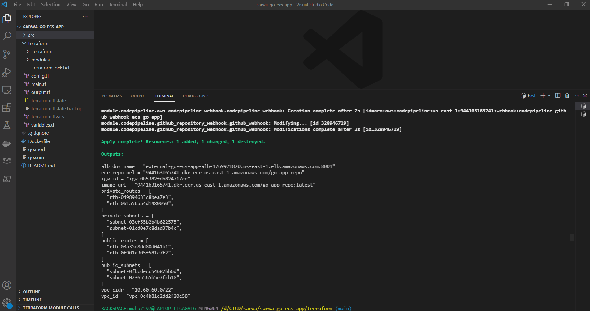

# Implementing CI/CD for Containerized Golang Application on AWS using ECS and CodePipeline.

## Demo

1. The first `.gif` below shows that the go rest API application can be accessible by hitting the application load balancer endpoint that is thrown at the output section after terraform completes the deployment.

2. The second `.gif` is about the CI/CD pipeline developed & deployed using some AWS services include AWS CodePipeline and AWS CodeBuild and this pipeline uses Github as source control. The pipeline can be kicked off by pushing changes to the main branch under this repository then it starts a new build using codebuild project to build & push a new docker image to amazon ECR and at the end, the pipeline will deploy these changes using amazon ECS to the configured ECS Cluster and service. It takes some time for the ALB target group to deregister the old versions of the ECS tasks.

